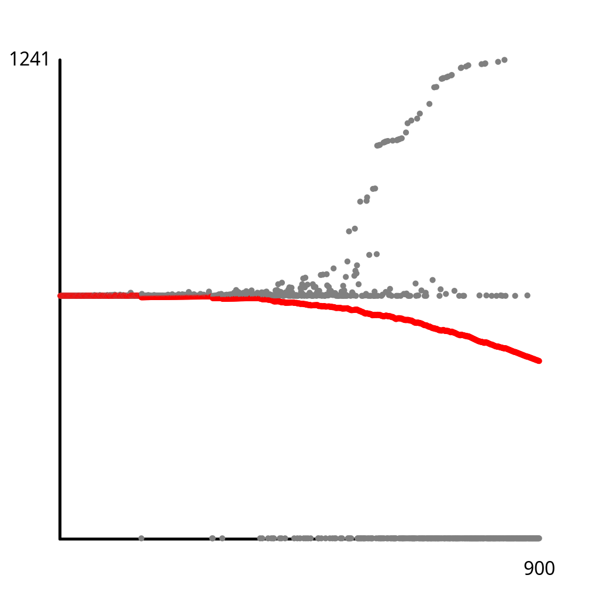
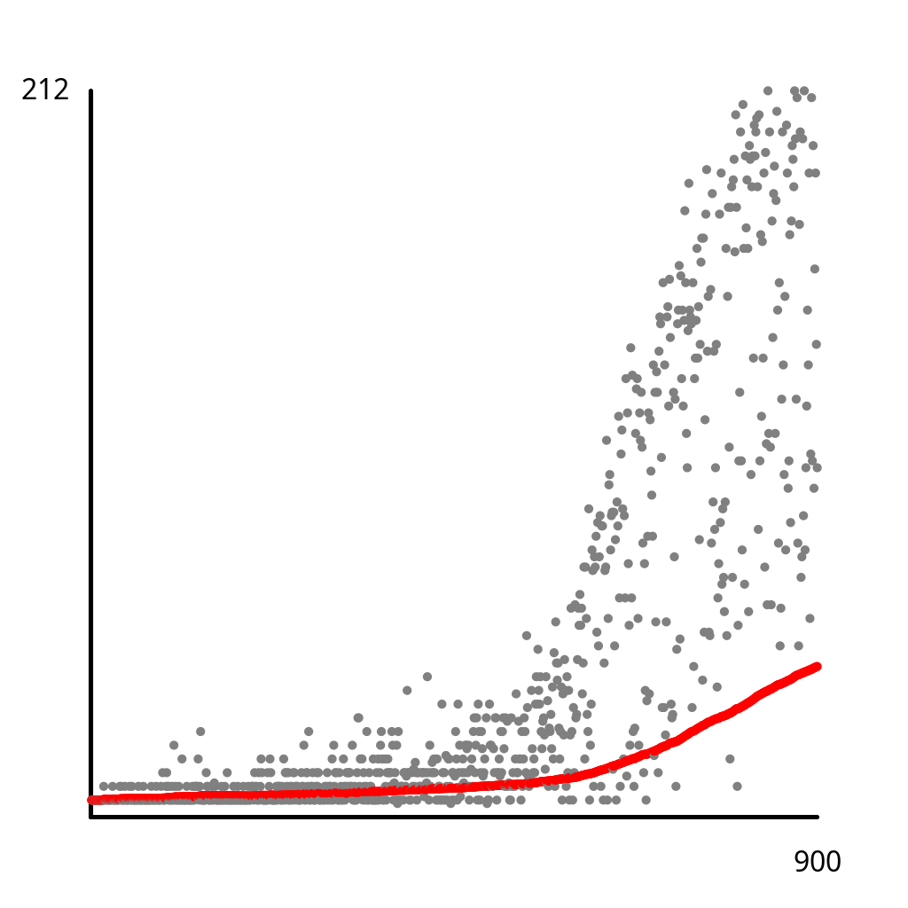

# Exercise 1.5.16

*Amortized cost plots*. Instrument your implementations from Exercise 1.5.7 to make amortized
cost plots like those in the text.

## Solution

Create an amortized cost plot for quick-find as follows:

```bash
./gradlew -q --console=plain -PmainClass=com.segarciat.algs4.ch1.sec5.ex16.QuickFindUF run < ./app/algs4-data/mediumUF.txt
```


Create an amortized cost plot for quick-union as follows:

```bash
./gradlew -q --console=plain -PmainClass=com.segarciat.algs4.ch1.sec5.ex16.QuickUnionUF run < ./app/algs4-data/mediumUF.txt
```


