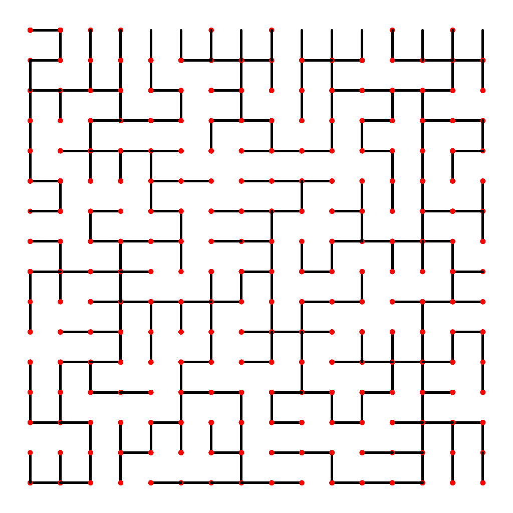

# Exercise 1.5.19

*Animation*. Write a `RandomGrid` client (see Exercise 1.5.18) that uses `UF`
as in our development client to check connectivity, and uses `StdDraw` to draw
the connections as they are processed.

## Solution

Run to create an animation with a 16 by 16 grid as follows:

```bash
./gradlew -q --console=plain -PmainClass=com.segarciat.algs4.ch1.sec5.ex19.RandomGridAnimation run --args='16'
```
