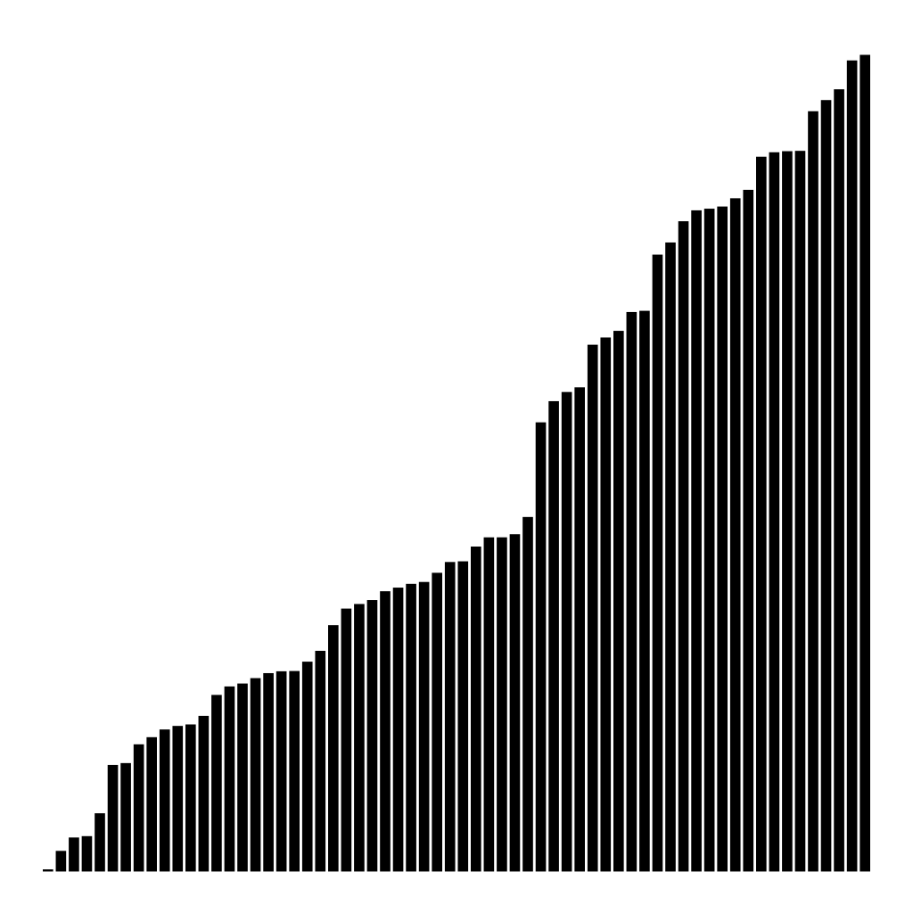

# Exercise 2.1.17

*Animation*. Add code to `Insertion`, `Selection`, and `Shell` to make them draw
the array contents  as vertical bars like the visual traces in this section,
redrawing the bars after each pass, to produce an animated effect, ending
in a ``sorted`` picture where the bars appear in order of their height.
*Hint*: Use a client like the one in the text that generates random `Double`
values, insert calls to `show()` as appropriate in the sort code, and implement
a `show()` method that clears the canvas and draws the bars.

## Solution

Run as follows to use Shell sort in order to sort an array of 64 random floating
point numbers between 0 and 1, and to see the animation with the vertical bars
being sorted:

```bash
./gradlew -q --console=plain -PmainClass=com.segarciat.algs4.ch2.sec1.ex17.Shell run --args='64'
```
