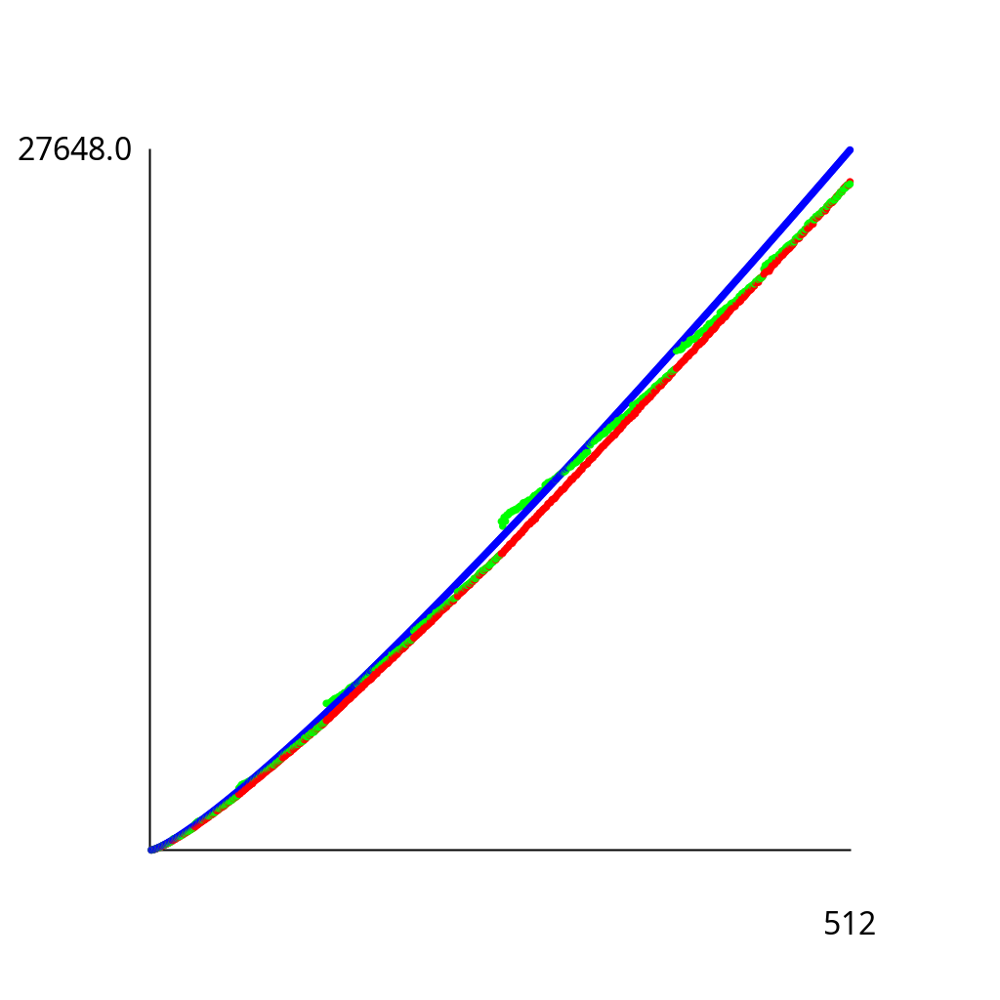

# Exercise 2.2.6

Write a program to compute the exact value of the number of array accesses
used by top-down mergesort and by bottom-up mergesort. Use your program
to plot the values for *n* from 1 to 512, and to compare the exact values
with the upper bound $6n\lg n$.

## Solution

Run as follows:

```bash
./gradlew -q --console=plain -PmainClass=com.segarciat.algs4.ch2.sec2.ex06.MergesortPlot run
```

See a sample plot below. In red is top-down mergesort, in green is bottom-up mergesort, and in
blue is the $6n\lg n$ upper-bound.

