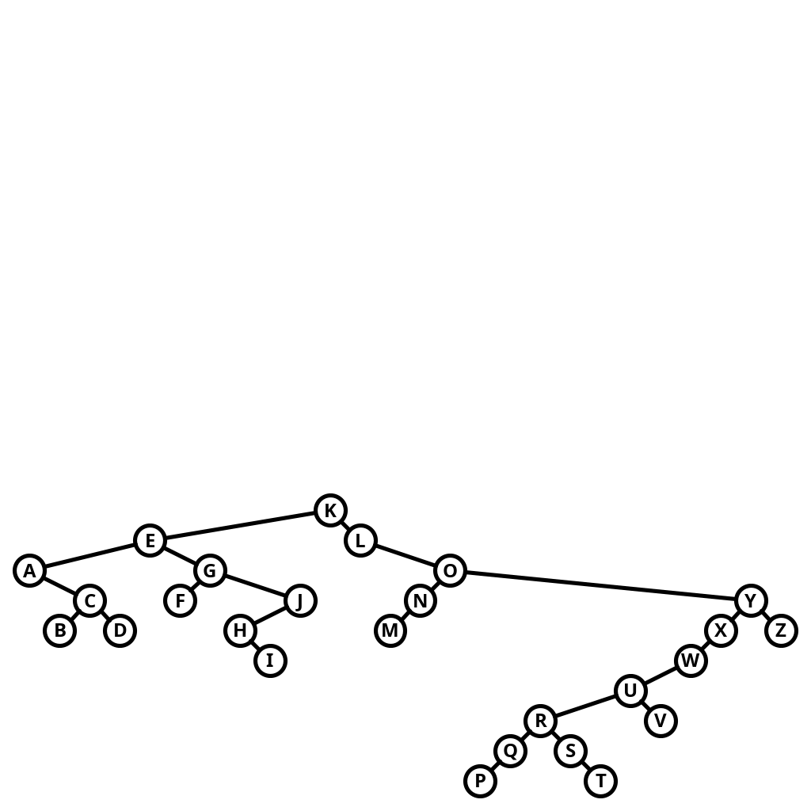

# Exercise 3.2.38

*Tree drawing*. Add a method `draw()` to `BST` that draws BST figures
in the style of the text. *Hint*: Use instance variables to hold node
coordinates, and use a recursive method to set the values of these
variables.

## Solution

To set the coordinates, I made use of each node's depth for the $y$g-coordinate
and the node's rank for the $x$-coordinate. To draw the lines from a node to
its children, I calculated the polar angle line connecting a node's center
coordinate its child's center coordinate. Using this angle and simple trigonometry,
I computed the endpoints of the line so that they would lie on the circumference
of the connecting circles.

Setting the scale was tough because the image would warp if the $x$ and $y$ scale
were not the same size. The resulting image looks small but the circles
retained their aspect ratio. See an example below:



To try it out, run as follows:

```bash
./gradlew -q --console=plain -PmainClass=com.segarciat.algs4.ch3.sec2.ex38.BST run
```