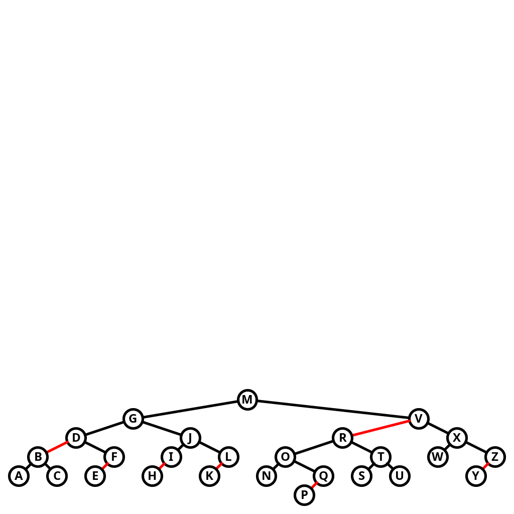

# Exercise 3.3.31

*Tree drawing*. Add a method `draw()` to `RedBlackBST` that draws red-black BST
figures in the style of the text (see Exercise 3.2.38).

## Solution

I based the drawing code on my implementation for Exercise 3.2.38. The changes I made
were the addition of the code to support the red-black BST, as code to draw the links
with the correct color.



To try it out, run as follows:

```bash
./gradlew -q --console=plain -PmainClass=com.segarciat.algs4.ch3.sec3.ex31.RedBlackBST run
```