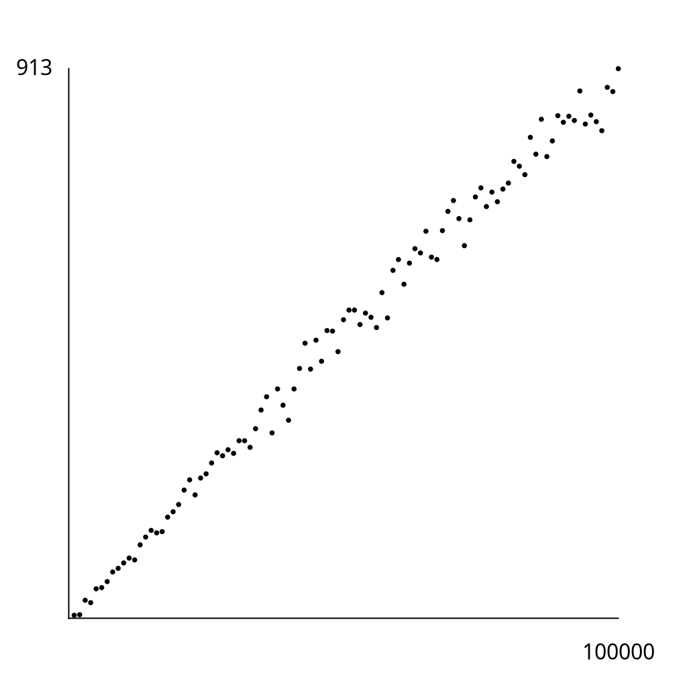

# Exercise 3.4.38

*Separate-chaining distribution*. Write a program that inserts $10^5$ random non-negative
integers less than $10^6$ into a hash table of size $10^5$ using separate chaining, and
that plots the total cost for each $10^3$ consecutive insertions. Discuss the extent to
which your results validate **Proposition K**.

## Solution

My program uses linked lists primitives as in Exercise 3.4.3. It also introduces
a static variable `compares` to count the number of compares using `equals()`
in the `put()` method. The plot below was created in a sample run of the program:

Notice that all costs are under 1000. Therefore, for the fixed table size of
$n=10^5$, $1000$ consecutive insertions tend to take less than $1000$ compares,
which means on average they all take about 1 compare. The fact that the cost is
less than 1000 across the board in the plot above implies that most keys hashed
to an empty list, so no call to `.equals()` was necessary. In any case, in relation
to **Proposition K**, this validates that for a fixed table size, the cost
of insertions is about equal to the ratio of the number of keys to the table size.
