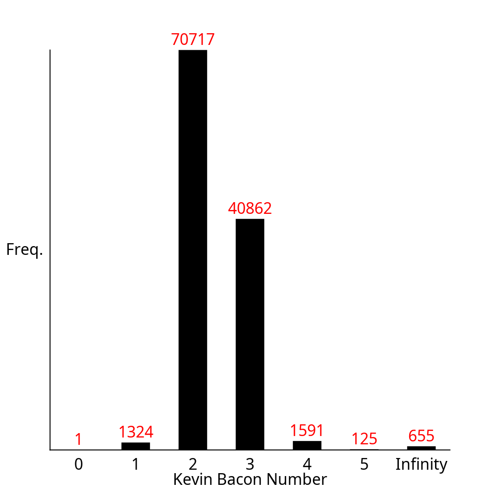

# Exercise 4.1.23

Write a program `BaconHistogram` that prints a histogram of Kevin Bacon
numbers, indicating how many performers from `movies.txt` have a Bacon
number of $0, 1, 2, 3, \ldots$. Include a category for those who have
an infinite number (not connected to Kevin Bacon).

## Solution

Run the program as follows:

```bash
./gradlew -q --console=plain -PmainClass=com.segarciat.algs4.ch4.sec1.ex23.BaconHistogram run --args='algs4-data/movies.txt "/" "Bacon, Kevin"'
```

The program produces the following text on standard output:

```text
Kevin Bacon Number:          0          Frequency: 1
Kevin Bacon Number:          1          Frequency: 1324
Kevin Bacon Number:          2          Frequency: 70717
Kevin Bacon Number:          3          Frequency: 40862
Kevin Bacon Number:          4          Frequency: 1591
Kevin Bacon Number:          5          Frequency: 125
Kevin Bacon Number:   Infinity          Frequency: 655
```

It also produces the following histogram:

